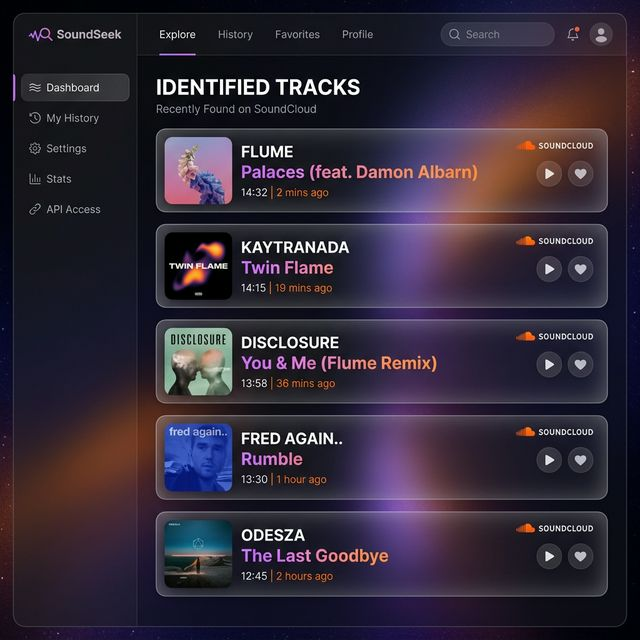
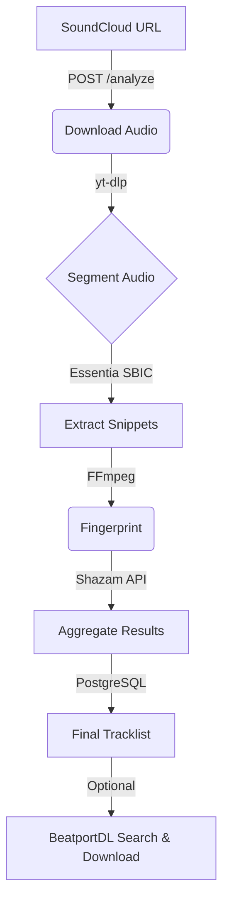

# 🎧 SoundCloud TrackID Grabber

[](https://www.docker.com/) 
[](https://fastapi.tiangolo.com/)
[](https://docs.celeryq.dev/)
[](https://redis.io/)
[](https://www.postgresql.org/)

**SoundCloud TrackID Grabber** is a powerful, self-hosted tool designed for DJs and music lovers. It automatically identifies every track in a SoundCloud mix by downloading the audio, detecting transitions, fingerprinting each segment, and returning a detailed, timestamped tracklist.

---

## 🖼️ Preview

<div align="center">
  
  <p><em>Premium, glassmorphic dashboard showcasing identified tracks.</em></p>
</div>

<div align="center">
  
  <p><em>Real-time progress tracking for background analysis tasks.</em></p>
</div>

---

## ✨ Key Features

- 🚀 **Full Mix Analysis**: Extract complete tracklists from any SoundCloud URL.
- ➗ **Smart Segmentation**: Uses Essentia’s **Sequential Bayesian Information Criterion (SBIC)** for accurate transition detection between tracks.
- 🔍 **AI Fingerprinting**: Segments are identified via the **Shazam API** (using `shazamio`) for high-accuracy results.
- 🛒 **BeatportDL Integration**: Automatically searches for identified tracks on Beatport and queues them for download.
- 📊 **Real-time Monitoring**: Track progress stage-by-stage and monitor background tasks via **Flower**.
- 🐳 **Docker-First Architecture**: Seamless deployment with a fully containerized setup.

---

## 🛠️ How It Works



1.  **Download**: High-quality audio is fetched using `yt-dlp` and stored on a RAM-disk.
2.  **Segment**: Musical transitions are detected using Essentia's SBIC algorithm.
3.  **Identify**: 12-second snippets are extracted and sent to the Shazam API.
4.  **Sync**: Results are aggregated, saved to the database, and optionally sent to **BeatportDL**.

---

## 📦 BeatportDL Integration

SoundCloud TrackID Grabber seamlessly integrates with **BeatportDL**. Once a track is identified, the system:
1.  Searches for the track on Beatport.
2.  Matches it with the top result.
3.  Automatically adds the Beatport URL to your download queue on BeatportDL.

*Requires a running instance of BeatportDL and the `BEATPORTDL_API_URL` environment variable.*

---

## 🚀 Quick Start

1.  **Clone & Configure**:
    ```bash
    git clone https://github.com/jranners/soundcloud_trackid_grap.git
    cd soundcloud_trackid_grap
    ```

2.  **Environment Setup**:
    Create a `.env` file or edit `docker-compose.yml` to set your credentials:
    ```env
FLOWER_USER=admin
FLOWER_PASSWORD=changeme
BEATPORTDL_API_URL=http://your-beatportdl-instance:8080
MAX_SHAZAM_CALLS_PER_ANALYSIS=30
    ```

3.  **Launch**:
    ```bash
    docker compose up --build -d
    ```

4.  **Analyze**:
    ```bash
    curl -X POST http://localhost:8000/analyze \
         -H "Content-Type: application/json" \
         -d '{"url": "https://soundcloud.com/user/mix-title"}'
    ```

---

## 🏗️ Technology Stack

- **Backend**: Python 3.12, FastAPI, Celery, SQLAlchemy
- **Database**: PostgreSQL (Data), Redis (Task Queue)
- **Audio Processing**: Essentia, FFmpeg, yt-dlp
- **Frontend Utilities**: Jinja2 (Templates), Tailwind CSS (for UI pages)
- **DevOps**: Docker, Docker Compose, Alembic (Migrations)

---

## 👨‍💻 API Endpoints

| Endpoint | Method | Description |
|---|---|---|
| `/analyze` | `POST` | Trigger a new mix analysis. |
| `/status/{task_id}` | `GET` | Get real-time progress of a task. |
| `/tracklist/{id}` | `GET` | Retrieve the completed tracklist including per-track confidence (`confidence_score`, `num_snippets`, `num_consistent_snippets`, `raw_matches_json`). |
| `/jobs` | `GET` | List recent analysis jobs. |
| `/docs` | `GET` | Interactive Swagger API documentation. |

---

## 📜 License

Distributed under the MIT License. See `LICENSE` for more information.

---

*Made for DJs, by DJs.* 🎧🔥
